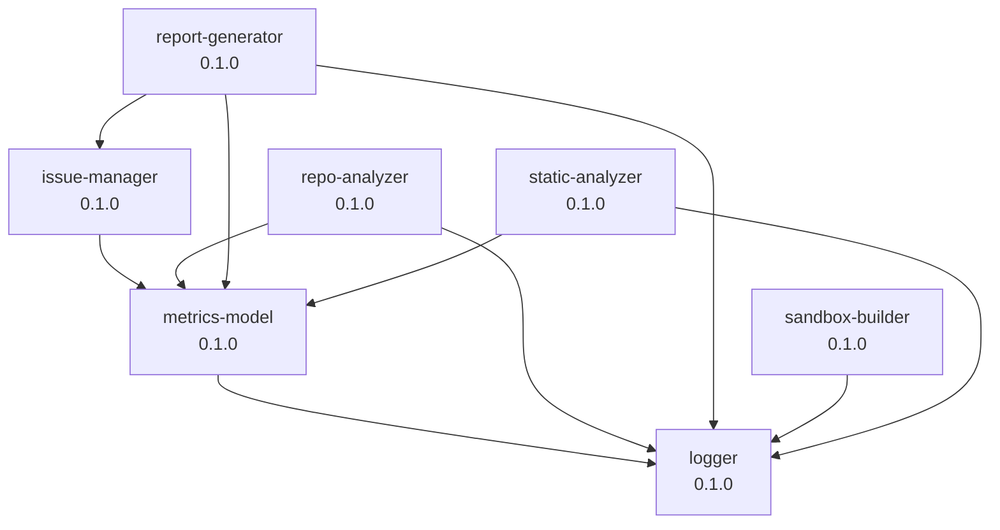

# IT Supervisor Tools

[](https://github.com/your-org/it-supervisor-tools/actions)
[](https://codecov.io/gh/your-org/it-supervisor-tools)
[](https://opensource.org/licenses/MIT)

**IT資産監査・改善サービス用ツール群** — TypeScriptで構築された、IT資産の自動分析・診断・改善提案を行うための統合ツールセット。

## 📦 パッケージ構成

このモノレポは、npm workspacesで管理された7つのパッケージで構成されています:

| パッケージ | 説明 | テストカバレッジ |
|-----------|------|----------------|
| [`@it-supervisor/metrics-model`](./packages/metrics-model) | メトリクスデータベース管理 | 96.31% |
| [`@it-supervisor/issue-manager`](./packages/issue-manager) | 問題管理・トラッキング | 95.06% |
| [`@it-supervisor/sandbox-builder`](./packages/sandbox-builder) | Docker環境自動構築 | 95.58% |
| [`@it-supervisor/report-generator`](./packages/report-generator) | レポート生成(HTML/PDF) | 89.10% |
| [`@it-supervisor/logger`](./packages/logger) | 構造化ロギング | 85.71% |
| [`@it-supervisor/static-analyzer`](./packages/static-analyzer) | 静的解析ツール統合 | 69.38% |
| [`@it-supervisor/repo-analyzer`](./packages/repo-analyzer) | Gitリポジトリ分析 | 69.71% ⬆️ |

**全体カバレッジ**: 84.79% ⬆️ (statements), 76.38% (branches), 86.23% (functions)

## 🚀 クイックスタート

### 前提条件

- **Node.js** >= 18.0.0
- **npm** >= 9.0.0
- **Git** (最新の安定版)
- **Docker** (オプション: sandbox-builder使用時)

### インストール

```bash
# リポジトリをクローン
git clone https://github.com/your-org/it-supervisor-tools.git
cd it-supervisor-tools

# 依存関係をインストール
npm install

# 全パッケージをビルド
npm run build
```

### 開発コマンド

```bash
# テストを実行
npm test

# テストをウォッチモードで実行
npm run test:watch

# カバレッジレポートを生成
npm run test:coverage

# ESLintでコードをチェック
npm run lint

# TypeScriptの型チェック
npm run type-check

# ビルド成果物をクリーンアップ
npm run clean
```

## 💡 使用例

### 1. リポジトリ分析

```typescript
import { RepositoryAnalyzer } from '@it-supervisor/repo-analyzer';

const analyzer = new RepositoryAnalyzer();
const result = await analyzer.analyzeLocal('./target-repo');

console.log('技術スタック:', result.techStack);
console.log('総ファイル数:', result.fileStats.totalFiles);
console.log('総コミット数:', result.gitHistory.totalCommits);
```

### 2. 静的解析の実行

```typescript
import { StaticAnalyzer } from '@it-supervisor/static-analyzer';

const analyzer = new StaticAnalyzer();
const results = await analyzer.analyze('./target-repo', {
  tools: ['eslint', 'snyk', 'gitleaks'],
  parallel: true,
  timeout: 300000
});

console.log(`Total issues: ${results.summary.totalIssues}`);
console.log(`Critical: ${results.summary.bySeverity.critical}`);
```

### 3. 問題管理

```typescript
import { IssueManager } from '@it-supervisor/issue-manager';

const manager = new IssueManager('./issues.db');

const issue = await manager.createIssue({
  projectId: 'proj-001',
  title: 'SQL Injection vulnerability',
  category: 'Security',
  severity: 'Critical',
  location: { file: 'src/auth/login.php', line: 42 }
});

await manager.updateIssueStatus(issue.id, 'InProgress');
```

### 4. メトリクス記録

```typescript
import { MetricsDatabase } from '@it-supervisor/metrics-model';

const db = new MetricsDatabase('./metrics.db');

await db.recordMetric({
  projectId: 'proj-001',
  category: 'Security',
  name: 'vulnerabilities_critical',
  value: 5,
  source: 'snyk',
  timestamp: new Date()
});

const comparison = await db.compareMetrics('proj-001', {
  beforeDate: new Date('2025-06-01'),
  afterDate: new Date('2025-12-01')
});
```

### 5. レポート生成

```typescript
import { ReportGenerator } from '@it-supervisor/report-generator';

const generator = new ReportGenerator();

const report = await generator.generate('Analysis', {
  projectName: 'Sample Project',
  customerName: 'ACME Corporation',
  data: { repoAnalysis, staticAnalysis, issues }
});

await generator.exportToPDF(report, './analysis-report.pdf');
```

### 6. サンドボックス環境構築

```typescript
import { SandboxBuilder } from '@it-supervisor/sandbox-builder';

const builder = new SandboxBuilder();

// 環境検出
const detection = await builder.detect('./target-app');
console.log('Detected:', detection.type);

// 環境構築・起動
const sandbox = await builder.build('./target-app', {
  outputDir: './sandbox-env',
  isolation: 'RESTRICTED'
});

await sandbox.up();
const health = await sandbox.health();
console.log('Healthy:', health.healthy);
```

## 🏗️ アーキテクチャ

### パッケージ依存関係



> 💡 **依存関係を生成**: `npm run deps` を実行すると、最新の依存関係グラフを生成できます。

### 設計原則

- **疎結合**: 各パッケージは独立して動作可能
- **型安全性**: TypeScriptによる厳格な型チェック
- **テスト駆動**: 高いテストカバレッジを維持
- **拡張性**: プラグインアーキテクチャで新機能を追加可能

## 🧪 テスト

プロジェクトは[Vitest](https://vitest.dev/)を使用してテストされています。

```bash
# 全テストを実行
npm test

# 特定のパッケージのみテスト
npm test -- packages/repo-analyzer

# カバレッジレポートを生成
npm run test:coverage
```

### テストカバレッジ基準

- **最低基準**: 70% (statements, branches, functions)
- **推奨基準**: 80% 以上
- **新規コード**: カバレッジを低下させない

詳細は [CONTRIBUTING.md](./CONTRIBUTING.md) を参照してください。

## 📚 ドキュメント

### メインドキュメント

- **[CONTRIBUTING.md](./CONTRIBUTING.md)**: 開発ガイドライン・コントリビューション方法
- **[SECURITY.md](./SECURITY.md)**: セキュリティポリシー・脆弱性報告手順
- **[progress.md](./progress.md)**: タスク進捗とプロジェクト履歴
- **[docs/RELEASE.md](./docs/RELEASE.md)**: リリースプロセス・バージョン管理

### 追加ドキュメント

- **[docs/API_INTEGRATION_GUIDE.md](./docs/API_INTEGRATION_GUIDE.md)**: 複数パッケージの統合ガイド（5つのE2Eワークフロー例）
- **[docs/USAGE_EXAMPLES.md](./docs/USAGE_EXAMPLES.md)**: 詳細な使用例とベストプラクティス
- **[docs/adr/](./docs/adr/)**: アーキテクチャ決定記録（ADR） — 設計判断の根拠と背景
- **[docs/archive/](./docs/archive/)**: 過去のドキュメントアーカイブ

### パッケージドキュメント

- [metrics-model](./packages/metrics-model/README.md) — メトリクスデータベース
- [issue-manager](./packages/issue-manager/README.md) — 問題管理
- [repo-analyzer](./packages/repo-analyzer/README.md) — リポジトリ分析
- [static-analyzer](./packages/static-analyzer/README.md) — 静的解析
- [report-generator](./packages/report-generator/README.md) — レポート生成
- [sandbox-builder](./packages/sandbox-builder/README.md) — サンドボックス環境

## 🛠️ 開発ワークフロー

### ブランチ戦略

- `main`: 安定版(本番環境相当)
- `develop`: 開発版(次期リリース候補)
- `feature/*`: 新機能開発
- `fix/*`: バグ修正
- `refactor/*`: リファクタリング

### コミット規約

[Conventional Commits](https://www.conventionalcommits.org/)に準拠:

```
<type>(<scope>): <description>

Types: feat, fix, test, docs, refactor, perf, chore
Scope: Package name (e.g., repo-analyzer, static-analyzer)
```

例:
```
feat(repo-analyzer): add dependency graph analysis
fix(sandbox-builder): resolve snapshot versioning bug
test(issue-manager): improve test coverage to 95%
docs(workspace): add comprehensive README.md
```

### Pull Request プロセス

1. フィーチャーブランチを作成
2. コードを実装し、テストを追加
3. `npm test` と `npm run lint` が成功することを確認
4. PRを作成し、レビューを依頼
5. CI/CDパイプラインが全てパスすることを確認
6. 承認後、マージ

詳細は [CONTRIBUTING.md](./CONTRIBUTING.md) を参照してください。

## 🔒 セキュリティ

セキュリティ脆弱性を発見した場合は、[SECURITY.md](./SECURITY.md)のガイドラインに従って報告してください。

**脆弱性の公開報告は避けてください**。責任ある開示にご協力をお願いします。

## 📄 ライセンス

このプロジェクトは [MIT License](./LICENSE) の下でライセンスされています。

## 🤝 コントリビューション

コントリビューションを歓迎します！以下の手順で参加できます:

1. このリポジトリをフォーク
2. フィーチャーブランチを作成 (`git checkout -b feature/amazing-feature`)
3. 変更をコミット (`git commit -m 'feat(scope): add amazing feature'`)
4. ブランチをプッシュ (`git push origin feature/amazing-feature`)
5. Pull Requestを作成

詳細は [CONTRIBUTING.md](./CONTRIBUTING.md) を参照してください。

## 📧 サポート

- **Issues**: [GitHub Issues](https://github.com/your-org/it-supervisor-tools/issues)
- **Discussions**: [GitHub Discussions](https://github.com/your-org/it-supervisor-tools/discussions)
- **Email**: support@example.com

## 🙏 謝辞

このプロジェクトは、以下のオープンソースプロジェクトに依存しています:

- [TypeScript](https://www.typescriptlang.org/)
- [Vitest](https://vitest.dev/)
- [ESLint](https://eslint.org/)
- [Puppeteer](https://pptr.dev/)
- [better-sqlite3](https://github.com/WiseLibs/better-sqlite3)
- [marked](https://marked.js.org/)

## 🗺️ ロードマップ

- [ ] **Phase 1**: コアパッケージの安定化(完了)
- [ ] **Phase 2**: テストカバレッジ向上(完了)
- [ ] **Phase 3**: CI/CDパイプライン構築(完了)
- [ ] **Phase 4**: ドキュメント整備(進行中)
- [ ] **Phase 5**: パフォーマンス最適化
- [ ] **Phase 6**: プラグインシステムの実装
- [ ] **Phase 7**: Web UIの開発

---

**Made with ❤️ by the IT Supervisor Tools Team**
